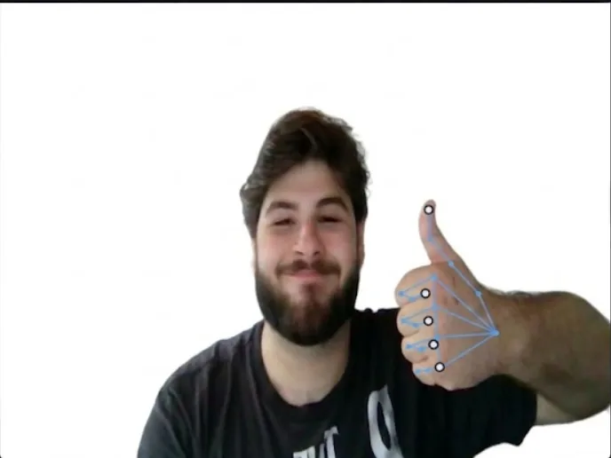

# Hand-Gestures

Real-time, offline computer control via webcam hand gestures using MediaPipe and OpenCV.

[Case Study](https://luantaraschi.dev/projeto-gesture.html)



## How it works

The system processes video frames through a modular Python pipeline (`capture.py` -> `hand_tracker.py` -> `filters.py` -> `gesture_engine.py` -> `actions.py`).

MediaPipe tracks 21 3D landmarks per hand at 30 FPS. The gesture engine (`gesture_engine.py`) classifies extended fingers using a 5-bit bitmask encoding (`THUMB | INDEX | MID | RING | PINKY`) combined with signed-distance ratios for rotation invariance.

Detected gestures trigger system actions via `actions.py` (such as volume control via `pycaw`, media playback, screenshots, and track navigation). A hold manager (`hold_manager.py`) enforces activation thresholds to prevent accidental command triggers. All processing runs locally on CPU without sending video data to external servers.

## Local setup

Requirements: Windows OS (for `pycaw` audio APIs), Python 3.10+, and a webcam.

```bash
python -m venv .venv
.venv\Scripts\activate
pip install -r requirements.txt
python backend/main.py
```

## State

The backend requires Windows OS for system volume control via `pycaw` and `comtypes`. Video input requires an active webcam. The project does not include an automated test suite.

## License

MIT
